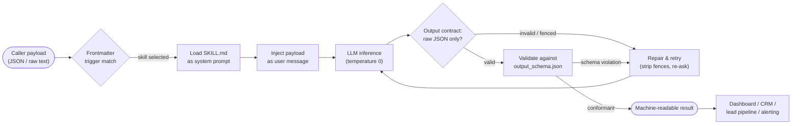
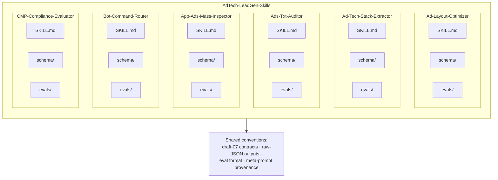

# AdTech-LeadGen-Skills

**A production-grade monorepo of schema-validated Agent Skills that automate AdTech lead generation, programmatic stack auditing, and publisher compliance checks — pure JSON in, pure JSON out.**

[](LICENSE)
[](#features)
[](#integration-testing--eval-harness)
[](#integration-testing--eval-harness)
[](#configuration)
[](#tech-stack--architecture)
[](#support-the-project)

`AdTech-LeadGen-Skills` is a curated collection of six autonomous, machine-to-machine (M2M) **Agent Skills** for the ad-tech domain. Each skill is a self-contained directory that packages a deterministic system prompt (`SKILL.md`), a formal input/output contract (JSON Schema `draft-07`), a regression eval suite (`evals/evals.json`), and the originating generator prompt (`meta-prompt.md`).

The library is **runtime-agnostic**: it carries zero compiled code and zero runtime dependencies, which means it runs unchanged inside Claude Code / Claude Desktop Agent Skills, ChatGPT system prompts, LangChain/LlamaIndex pipelines, or any HTTP LLM API you already operate.

> [!NOTE]
> Every skill is engineered around a **strict output contract**: the model returns a single raw JSON object or array — never prose, never markdown fences, never emojis. This makes the outputs directly consumable by CI jobs, dashboards, CRMs, and lead-generation pipelines without any parsing heuristics.

> [!IMPORTANT]
> This repository contains **prompt assets, schemas, and eval definitions** — not executable application code. "Installation" means placing skill directories where your agent runtime can discover them; "testing" means validating JSON contracts statically and executing the bundled eval suites against a model of your choice.

---

## Table of Contents

- [Features](#features)
- [Tech Stack & Architecture](#tech-stack--architecture)
  - [Core Technologies](#core-technologies)
  - [Project Structure](#project-structure)
  - [Key Design Decisions](#key-design-decisions)
- [Getting Started](#getting-started)
  - [Prerequisites](#prerequisites)
  - [Installation](#installation)
- [Testing](#testing)
  - [Static Validation (Unit)](#static-validation-unit)
  - [Integration Testing / Eval Harness](#integration-testing--eval-harness)
  - [Linters & Formatting](#linters--formatting)
- [Deployment](#deployment)
  - [Build & Packaging](#build--packaging)
  - [Containerization](#containerization)
  - [CI/CD Pipeline](#cicd-pipeline)
- [Usage](#usage)
  - [Basic Usage](#basic-usage)
  - [Advanced Usage](#advanced-usage)
  - [Custom Formatters](#custom-formatters)
  - [Edge Cases](#edge-cases)
- [Configuration](#configuration)
  - [Environment Variables](#environment-variables)
  - [Startup Flags](#startup-flags)
  - [Configuration File](#configuration-file)
- [License](#license)
- [Support the Project](#support-the-project)

---

## Features

**Six production-grade skills, one uniform architecture**

| Skill | Purpose | Governing Standards | Input | Output |
|---|---|---|---|---|
| `Ad-Layout-Optimizer` | Viewability diagnostics and per-slot layout optimization for publisher pages | IAB Viewability, Better Ads Standards | JSON layout descriptor | Viewability score, violations, recommendations |
| `Ad-Tech-Stack-Extractor` | Fingerprints and categorizes ad tech present in HTML, DOM fragments, JS, or HTTP headers | Programmatic taxonomy (SSP/DSP/ad server) | Raw source string | Four categorized arrays + confidence score |
| `Ads-Txt-Auditor` | Line-by-line `ads.txt` compliance audit with GAB verification | IAB Tech Lab `ads.txt` v1.1 | Raw `ads.txt` text | JSON array of findings (`[]` when compliant) |
| `App-Ads-Mass-Inspector` | Batch validation of `app-ads.txt` files for mobile authorization compliance | IAB `app-ads.txt`, GAM GAB rules | Array of developer records | Per-record validity + GAB verdict |
| `Bot-Command-Router` | NLP intent router for internal Slack/Telegram AdOps bots | Closed intent taxonomy | Plain-text chat message | Intent + extracted parameters + confidence |
| `CMP-Compliance-Evaluator` | GDPR/CCPA audit of publisher pages via DOM `<head>` and intercepted network requests | IAB TCF v2.2, CCPA/CPRA | DOM fragment + request array | Compliance verdict + risk severity |

**Core capabilities**

- **Schema-first contracts** — every skill ships `schema/input_schema.json` and `schema/output_schema.json` (JSON Schema `draft-07`, `additionalProperties: false`), so integration is a typed handshake rather than prompt guesswork.
- **Strict serialization contract** — outputs are always a single raw JSON object or array. No markdown fences, no preamble, no trailing commentary. Empty results are represented canonically (`[]` / `null`), never prose.
- **Non-hallucination guardrails** — evidence-only reporting is enforced as a first-class rule. The `Ad-Tech-Stack-Extractor` maintains an explicit **exclusion list** (GA4, GTM, Segment, Hotjar, Mixpanel, Amplitude, Comscore, Nielsen, …) and reports empty arrays when no ad-tech signal exists.
- **Calibrated confidence scoring** — machine-readable certainty is part of the contract: `0–100` integer scoring for stack extraction (strong vs. weak signal weighting) and `0.0–1.0` float scoring for intent classification.
- **Deterministic, persona-driven system prompts** — each `SKILL.md` declares a senior-domain persona (UX/Viewability Analyst, AdTech Systems Intelligence Parser, Compliance Auditor, …) plus explicit rule tables, eliminating stylistic drift across runs.
- **Severity classification** — compliance findings are tiered (`critical` / `warning`; `Safe` / `Warning` / `Critical`) so downstream systems can route, alert, or block automatically.
- **YAML frontmatter trigger contract** — each `SKILL.md` opens with `name` + `description` frontmatter containing explicit trigger phrases, enabling automatic skill discovery and routing by the host agent runtime.
- **Bundled regression evals** — 20 eval cases with 56 assertions in the standard *skill-creator* format, covering happy paths, syntax failures, duplicates, GAB edge cases, and unknown-intent fallbacks.
- **Batch processing with state isolation** — `App-Ads-Mass-Inspector` processes record arrays independently, preserving input order and preventing cross-record state contamination.
- **Documented edge-case handling** — empty arrays, unparseable sizes, unknown slot positions, missing geo, malformed input JSON, and analytics-only inputs are all specified explicitly.
- **Reproducible provenance** — every skill includes its `meta-prompt.md` generator prompt, so any skill can be regenerated, forked, or extended deterministically.
- **Model-agnostic** — works with Claude Agent Skills, ChatGPT custom instructions, or any OpenAI-compatible chat completions endpoint. No vendor lock-in.
- **Zero runtime dependencies** — pure Markdown + JSON. Nothing to compile, nothing to `npm install`, nothing to break.
- **Commercial-friendly licensing** — Apache License 2.0, safe for proprietary and commercial derivative works.

---

## Tech Stack & Architecture

### Core Technologies

| Layer | Technology | Role |
|---|---|---|
| Prompt layer | GitHub-Flavored Markdown (GFM) | System prompts, personas, rule tables, worked examples |
| Contract layer | JSON Schema `draft-07` | Typed input/output validation with `enum`, `pattern`, `additionalProperties: false` |
| Test layer | JSON (skill-creator eval format) | Prompt/assertion regression suites |
| Provenance layer | Markdown (CRLF) | `meta-prompt.md` generator prompts for reproducibility |
| Distribution layer | Git / tarball | Versioning and skill packaging |
| Optional tooling | Node.js ≥ 18, Python ≥ 3.9, `jq` | Schema validation, eval execution, JSON linting |
| Optional tooling | `markdownlint-cli2`, `prettier` | Markdown and JSON formatting gates in CI |

> [!TIP]
> There is **no application runtime** in this repository. The "tech stack" is deliberately a documentation-as-configuration stack: Markdown prompts are the executable surface, and JSON Schema is the type system. This is what makes the library portable across every major agent runtime.

### Project Structure

<details>
<summary><b>Expand full repository file tree</b> (6 skills · 32 tracked files)</summary>

```text
AdTech-LeadGen-Skills/
├── Ad-Layout-Optimizer/               # Viewability & Better Ads diagnostics
│   ├── SKILL.md                       #   202 lines — persona, rules, logic, examples
│   ├── meta-prompt.md                 #   generator prompt (CRLF line endings)
│   ├── evals/
│   │   └── evals.json                 #   3 eval cases / 6 assertions
│   └── schema/
│       ├── input_schema.json          #   device_type, ad_density_percentage, current_ad_slots
│       └── output_schema.json         #   viewability_score_estimate, layout_violations, …
│
├── Ad-Tech-Stack-Extractor/           # Programmatic stack fingerprinting
│   ├── SKILL.md                       #   232 lines — signal tables + exclusion list
│   ├── meta-prompt.md
│   ├── evals/
│   │   └── evals.json                 #   3 eval cases / 7 assertions
│   └── schema/
│       ├── input_schema.json          #   { "source": "<html|js|headers>" }
│       └── output_schema.json         #   4 arrays + confidence_score (0–100)
│
├── Ads-Txt-Auditor/                   # IAB ads.txt v1.1 compliance auditor
│   ├── SKILL.md                       #   268 lines — parser pseudocode + GAB rules
│   ├── meta-prompt.md
│   ├── evals/
│   │   └── evals.json                 #   4 eval cases / 5 assertions
│   └── schema/
│       ├── input_schema.json          #   raw ads.txt text
│       └── output_schema.json         #   findings[] with error_type / severity / suggested_fix
│
├── App-Ads-Mass-Inspector/            # Batch app-ads.txt validation
│   ├── SKILL.md                       #   268 lines — batch parsing + GAB verification
│   ├── meta-prompt.md
│   ├── evals/
│   │   └── evals.json                 #   3 eval cases / 13 assertions
│   └── schema/
│       ├── input_schema.json          #   [{ developer_url, app_ads_content }]
│       └── output_schema.json         #   [{ is_completely_valid, gab_verified, errors_found }]
│
├── Bot-Command-Router/                # NLP intent router for AdOps bots
│   ├── SKILL.md                       #   155 lines — intent taxonomy + extraction rules
│   ├── meta-prompt.md
│   ├── evals/
│   │   └── evals.json                 #   4 eval cases / 8 assertions
│   └── schema/
│       ├── input_schema.json          #   raw chat message string
│       └── output_schema.json         #   intent + extracted_parameters + confidence
│
├── CMP-Compliance-Evaluator/          # GDPR / CCPA / TCF v2.2 auditor
│   ├── SKILL.md                       #   242 lines — 5-step detection logic + severity matrix
│   ├── meta-prompt.md
│   ├── evals/
│   │   └── evals.json                 #   3 eval cases / 17 assertions
│   └── schema/
│       ├── input_schema.json          #   dom_head + network_requests[]
│       └── output_schema.json         #   cmp_detected, tcf_v2_compliant, risk_severity, …
│
├── LICENSE                            # Apache License 2.0
└── README.md                          # This document
```

**Per-skill anatomy** — every skill directory follows an identical five-file convention:

```text
<Skill-Name>/
├── SKILL.md                  # Runtime system prompt: frontmatter, persona, rules, logic, examples
├── schema/
│   ├── input_schema.json     # Draft-07 contract for the request payload
│   └── output_schema.json    # Draft-07 contract for the response payload
├── evals/
│   └── evals.json            # Regression suite: { skill_name, evals[{ id, prompt, assertions }] }
└── meta-prompt.md            # Generator prompt that produced this skill (reproducibility)
```

</details>

### Key Design Decisions

<details>
<summary><b>Expand architectural rationale and pipeline diagram</b></summary>

**1. One directory per skill (Agent Skills convention).**
Each skill is a self-contained, relocatable unit. Dropping a directory into `~/.claude/skills/`, a ChatGPT project, or a Docker image is the entire "integration" step. There is no registry to update and no manifest to reconcile.

**2. Contracts before prompts (schema-first).**
The JSON Schema pair is authored first and treated as the source of truth. The `SKILL.md` prompt is then written to satisfy that contract exactly, including `additionalProperties: false` on both sides. This prevents the most common failure mode of prompt engineering: silent schema drift.

**3. Frontmatter as a routing contract.**
`name` + `description` YAML frontmatter carries the trigger vocabulary ("check ads.txt", "detect Prebid", "verify TCF v2.2", …). Host runtimes use this metadata for automatic skill selection, so the routing surface is declarative rather than hard-coded.

**4. Separation of the four concerns.**

| Artifact | Concern | Consumer |
|---|---|---|
| `SKILL.md` | Runtime behavior (persona, rules, logic) | LLM at inference time |
| `schema/*.json` | Type safety and validation | Caller / CI / gateway |
| `evals/evals.json` | Regression behavior over time | Test harness |
| `meta-prompt.md` | Provenance and regeneration | Maintainers |

**5. Evidence-only (non-hallucination) architecture.**
Rather than relying on the model to "be careful", each skill encodes an explicit detection table plus a deny-list, and defines the *correct* empty output (`[]`, `null`, `confidence_score: 0`). Absence of evidence is a first-class, specifiable result.

**6. Raw-JSON serialization contract.**
Because consumers are machines (dashboards, CRMs, lead pipelines), the output contract forbids markdown fences and prose. Downstream code can call `JSON.parse()` directly with no pre-processing — a small constraint that removes an entire class of integration bugs.

**7. Scoring as part of the payload.**
Confidence and severity are returned as data, not commentary, so callers can implement policy (e.g., "only escalate findings with `severity == critical`") without re-parsing natural language.

**8. Zero-dependency portability.**
By refusing to introduce a runtime, package manager, or build tool, the library remains usable from any language and any deployment target — including air-gapped environments where the skill files are simply mounted as configuration.

**Request → response pipeline:**



**Skill composition inside the monorepo:**



</details>

---

## Getting Started

### Prerequisites

| Requirement | Version | Purpose | Required? |
|---|---|---|---|
| `git` | ≥ 2.30 | Clone the repository | ✅ Yes |
| An LLM runtime | — | Claude Code / Claude Desktop (Agent Skills), ChatGPT, or any chat-completions API | ✅ Yes |
| `jq` | ≥ 1.6 | Inspect and validate JSON assets | ⬜ Optional |
| Node.js | ≥ 18 | Schema validation via `ajv`, linting via `markdownlint-cli2` / `prettier` | ⬜ Optional |
| Python | ≥ 3.9 | Reference eval harness (`jsonschema`, provider SDK) | ⬜ Optional |
| Docker | ≥ 24 | Containerized skill-serving API | ⬜ Optional |

You will also need an API key for your chosen model provider (e.g. `ANTHROPIC_API_KEY` or `OPENAI_API_KEY`). Never commit keys to the repository — see [Configuration](#configuration).

### Installation

**1. Clone the repository**

```bash
git clone https://github.com/adops-tool/AdTech-LeadGen-Skills.git
cd AdTech-LeadGen-Skills
```

**2. Verify the asset inventory**

```bash
# Confirm all 12 schema documents parse as valid JSON
find . -path ./.git -prune -o -name '*.json' -print | while read -r f; do
  jq empty "$f" && echo "OK  $f"
done

# List the available skills
ls -d */ | tr -d '/'
```

**3. Install into your agent runtime**

*Claude Code / Claude Desktop (Agent Skills):*

```bash
# Install all skills
mkdir -p ~/.claude/skills
cp -R Ad-Layout-Optimizer Ad-Tech-Stack-Extractor Ads-Txt-Auditor \
      App-Ads-Mass-Inspector Bot-Command-Router CMP-Compliance-Evaluator \
      ~/.claude/skills/

# Or install a single skill on demand
cp -R Ads-Txt-Auditor ~/.claude/skills/
```

*Any LLM API (manual wiring):*

```bash
# The SKILL.md file *is* the system prompt — no build step required
SKILL=$(cat Ads-Txt-Auditor/SKILL.md)
echo "$SKILL" | head -20   # sanity check: frontmatter, persona, rules
```

> [!TIP]
> Skills are discovered by their YAML frontmatter. If a skill does not appear in your runtime, confirm the frontmatter block at the top of `SKILL.md` still contains a `name:` and a `description:` key, and that the file begins with the opening `---` fence on line 1.

<details>
<summary><b>Alternative installation methods, building from source, and troubleshooting</b></summary>

**Install a single skill via sparse checkout (minimal footprint)**

```bash
git clone --filter=blob:none --no-checkout https://github.com/adops-tool/AdTech-LeadGen-Skills.git
cd AdTech-LeadGen-Skills
git sparse-checkout init --cone
git sparse-checkout set Ads-Txt-Auditor
git checkout main
```

**Install from a release tarball (air-gapped environments)**

```bash
curl -fsSL -o skills.tar.gz \
  https://github.com/adops-tool/AdTech-LeadGen-Skills/archive/refs/heads/main.tar.gz
tar -xzf skills.tar.gz
cp -R AdTech-LeadGen-Skills-main/Ads-Txt-Auditor ~/.claude/skills/
```

**"Building from source" — validation & packaging pipeline**

Because the library ships no compiled code, the build step is a verification and packaging pass:

```bash
# 1. Install optional tooling
npm install --global markdownlint-cli2 prettier ajv-cli
pip install jsonschema

# 2. Compile-check every JSON Schema document
for f in */schema/*.json; do
  npx ajv compile --strict=false -s "$f" && echo "COMPILED  $f"
done

# 3. Package a distributable skill bundle
mkdir -p dist
for d in */; do
  name=$(basename "$d")
  tar -czf "dist/${name}.tar.gz" "$name"
done
ls -lh dist/
```

**Troubleshooting**

| Symptom | Likely cause | Fix |
|---|---|---|
| Skill not discovered by the runtime | Frontmatter missing or directory not in the skills path | Verify `~/.claude/skills/<Skill-Name>/SKILL.md` exists and starts with `---` on line 1 |
| `jq: error ... Invalid literal` | File edited with a BOM or trailing comma | Re-save as UTF-8 without BOM; run `npx prettier --write "**/*.json"` |
| Model returns markdown-fenced JSON | Prompt truncated or temperature too high | Set `temperature = 0`, raise `max_tokens`, and enable fence-stripping in the client |
| Lint failures on `meta-prompt.md` | Those files are authored with CRLF line endings by design | Normalize with `sed -i 's/\r$//' */meta-prompt.md`, or add them to `.markdownlintignore` |
| Eval assertions fail intermittistically | Non-deterministic decoding | Pin `temperature = 0` and a fixed model version in the harness |
| Windows clone shows `^M` characters | Git `core.autocrlf` converting on checkout | `git config --global core.autocrlf input` and re-clone |

</details>

---

## Testing

The test strategy mirrors the repository's layered architecture: **static contract validation** (unit), **behavioral evals** (integration), and **formatting gates** (linters).

### Static Validation (Unit)

Validate that every JSON asset is syntactically valid and that every schema compiles:

```bash
# 1. Parse-check all JSON (schemas + eval suites)
find . -path ./.git -prune -o -name '*.json' -print | while read -r f; do
  jq empty "$f" && echo "PASS  $f" || echo "FAIL  $f"
done

# 2. Compile every JSON Schema document with ajv (strict=false — see note below)
for f in */schema/*.json; do
  npx ajv compile --strict=false -s "$f" >/dev/null && echo "COMPILED  $f"
done

# 3. Structural check on eval suites: skill_name present, ≥1 eval, assertions non-empty
jq -e '.skill_name and (.evals | length > 0) and (all(.evals[]; .assertions | length > 0))' \
  */evals/evals.json
```

> [!NOTE]
> All 12 schema documents compile cleanly, but `ajv` must be invoked with `--strict=false`. Three of them use **non-standard annotation keywords** that draft-07 permits (unknown keywords are ignored by spec) but that ajv's default strict mode rejects: `notes` and `examples` at the schema root of `Ad-Tech-Stack-Extractor/schema/*.json`, and `"format": "uri"` in `CMP-Compliance-Evaluator/schema/input_schema.json` (formats are advisory annotations in draft-07 unless a format library such as `ajv-formats` is registered). This is intentional documentation metadata, not a schema defect.

### Integration Testing / Eval Harness

Each skill ships an `evals/evals.json` suite in the standard *skill-creator* format:

```json
{
  "skill_name": "Ads-Txt-Auditor",
  "evals": [
    {
      "id": 1,
      "prompt": "Audit this ads.txt file and return a JSON array of compliance errors. …",
      "expected_output": "[]",
      "files": [],
      "assertions": ["output == []"]
    }
  ]
}
```

Run the full inventory (20 cases / 56 assertions) with the reference harness below, or inspect a single suite:

```bash
# Inspect one suite
jq '.evals[] | {id, assertions}' Ads-Txt-Auditor/evals/evals.json

# Execute the reference harness (see details block for the script)
python3 scripts/run_evals.py --all --model claude-sonnet-4-5 --strict

# Execute one skill only
python3 scripts/run_evals.py --skill CMP-Compliance-Evaluator --model claude-sonnet-4-5
```

<details>
<summary><b>Reference eval harness (<code>scripts/run_evals.py</code>)</b></summary>

Save the following as `scripts/run_evals.py`. It is a **reference implementation** — the repository ships the eval *definitions*, and this harness executes them against the model provider of your choice, validating every response against the skill's output schema before applying the string assertions.

```python
#!/usr/bin/env python3
"""Reference eval harness for AdTech-LeadGen-Skills.

Loads each skill's SKILL.md as the system prompt, replays every eval prompt,
validates the response against schema/output_schema.json, then evaluates the
suite's string assertions. Exit code is non-zero if any assertion fails.

Usage:
    python3 scripts/run_evals.py --all
    python3 scripts/run_evals.py --skill Ads-Txt-Auditor
"""
from __future__ import annotations

import argparse
import json
import re
import sys
from pathlib import Path

from anthropic import Anthropic          # pip install anthropic jsonschema
from jsonschema import Draft7Validator

ROOT = Path(__file__).resolve().parent.parent
DEFAULT_MODEL = "claude-sonnet-4-5"


def strip_fences(text: str) -> str:
    """Defensive: remove accidental markdown fences around JSON output."""
    fence = "`" * 3  # built dynamically — a literal fence inside a fenced block is fragile
    return re.sub(rf"^{fence}(?:json)?|{fence}$", "", text.strip(), flags=re.MULTILINE).strip()


def load_skill(skill_dir: Path) -> tuple[str, dict]:
    system_prompt = (skill_dir / "SKILL.md").read_text(encoding="utf-8")
    output_schema = json.loads((skill_dir / "schema" / "output_schema.json").read_text())
    return system_prompt, output_schema


def run_skill(client: Anthropic, model: str, system_prompt: str, prompt: str) -> str:
    message = client.messages.create(
        model=model,
        max_tokens=2048,
        temperature=0.0,                 # deterministic decoding for reproducible evals
        system=system_prompt,
        messages=[{"role": "user", "content": prompt}],
    )
    return strip_fences("".join(b.text for b in message.content if b.type == "text"))


def evaluate(skill: str, model: str) -> int:
    skill_dir = ROOT / skill
    system_prompt, output_schema = load_skill(skill_dir)
    suite = json.loads((skill_dir / "evals" / "evals.json").read_text())
    client = Anthropic()                # reads ANTHROPIC_API_KEY from the environment

    failures = 0
    for case in suite["evals"]:
        raw = run_skill(client, model, system_prompt, case["prompt"])
        try:
            payload = json.loads(raw)
        except json.JSONDecodeError as exc:
            print(f"  [FAIL] {skill} #{case['id']}: invalid JSON ({exc})")
            failures += 1
            continue

        # Contract gate: response must satisfy the published output schema.
        errs = sorted(Draft7Validator(output_schema).iter_errors(payload), key=str)
        if errs:
            print(f"  [FAIL] {skill} #{case['id']}: schema violation: {errs[0].message}")
            failures += 1
            continue

        blob = json.dumps(payload)
        for assertion in case["assertions"]:
            ok = assertion.lower() in blob.lower() or _eval_expr(assertion, payload)
            print(f"  [{'PASS' if ok else 'FAIL'}] {skill} #{case['id']}: {assertion}")
            failures += 0 if ok else 1

    print(f"{skill}: {len(suite['evals'])} cases evaluated, {failures} failure(s)")
    return failures


def _eval_expr(assertion: str, payload) -> bool:
    """Best-effort evaluation of simple '<path> == <value>' assertions."""
    if "==" not in assertion:
        return False
    path, expected = (p.strip() for p in assertion.split("==", 1))
    node = payload
    try:
        for part in path.split("."):
            node = node[int(part)] if isinstance(node, list) else node[part]
    except (KeyError, IndexError, ValueError, TypeError):
        return False          # path does not exist in the payload
    return str(node).strip("'\"") == expected.strip("'\"")


if __name__ == "__main__":
    ap = argparse.ArgumentParser()
    ap.add_argument("--skill")
    ap.add_argument("--all", action="store_true")
    ap.add_argument("--model", default=DEFAULT_MODEL)
    args = ap.parse_args()

    skills = sorted(p.name for p in ROOT.iterdir() if (p / "SKILL.md").exists())
    targets = skills if args.all else [args.skill]
    sys.exit(1 if sum(evaluate(s, args.model) for s in targets) else 0)
```

```bash
pip install anthropic jsonschema
export ANTHROPIC_API_KEY="sk-ant-…"
python3 scripts/run_evals.py --all
```

</details>

### Linters & Formatting

```bash
# Markdown lint — CI gate, scoped to README.md (see debt note below)
npx markdownlint-cli2 "README.md"

# Full-repo formatting audit (reports pre-existing drift — see debt note below)
npx prettier --check "**/*.json"

# YAML frontmatter sanity check for every SKILL.md
for f in */SKILL.md; do
  head -1 "$f" | grep -q '^---$' && echo "FRONTMATTER OK  $f"
done
```

> [!NOTE]
> The repository ships a `.markdownlint.json` that disables the rules incompatible with this documentation style: `MD013` (80-char line limit — badge rows and wide reference tables legitimately exceed it), `MD033` for the `<details>` / `<summary>` collapsible blocks this README relies on, `MD036` (bold pseudo-headings), `MD028` (consecutive GitHub alert blockquotes), and `MD060` (compact table pipe style). Everything else runs at full strictness.

> [!IMPORTANT]
> **Known pre-existing formatting debt (not a regression).** Running the linters across the whole repository currently reports `MD031` (blank lines around fenced code blocks) in the six `*/SKILL.md` files, and `prettier --check` reports style drift in eight `*/schema/*.json` and `*/evals/evals.json` files. The CI gate is therefore scoped to `README.md` and to files changed by a pull request. Normalizing the historical corpus is a separate mechanical pass (`npx markdownlint-cli2 --fix` and `npx prettier --write`) and should land in its own PR so the diff stays reviewable.

> [!CAUTION]
> `*/meta-prompt.md` files are authored with **CRLF** line endings and will trip strict Markdown linters out of the box. Either normalize them (`sed -i 's/\r$//' */meta-prompt.md`) or exclude them via `.markdownlintignore`. Do not "fix" them in a feature PR without noting the line-ending change in the PR description.

> [!NOTE]
> Eval suites are **behavioral**, not purely deterministic: the same prompt can produce different JSON on different model versions. Pin the model ID and `temperature = 0` in CI, and treat assertion failures as a prompt-regression signal to triage — not automatically as a code bug.

---

## Deployment

### Build & Packaging

There is no compilation step. The deployable artifact is the skill directory itself:

```bash
# Produce a per-skill distributable bundle
mkdir -p dist
for d in */; do
  name=$(basename "$d")
  tar --exclude="$name/evals" -czf "dist/${name}.tar.gz" "$name"   # evals stay in-repo
done
sha256sum dist/*.tar.gz | tee dist/SHA256SUMS
```

Distribution targets:

1. **Agent runtime skills directory** — `cp -R <Skill> ~/.claude/skills/` (see [Installation](#installation)).
2. **Container image** — bake the skills into an image and mount/run a thin skill-serving API (see below).
3. **Internal registry / Git submodule** — pin a specific tag or commit for reproducible agent builds:

   ```bash
   git submodule add -b main https://github.com/adops-tool/AdTech-LeadGen-Skills.git skills
   ```

> [!IMPORTANT]
> Always deploy a **pinned commit or tag**, never a floating branch, into production agent runtimes. Because skills are prompts, an accidental upstream edit to a `SKILL.md` rule table silently changes production audit behavior.

### Containerization

<details>
<summary><b>Dockerfile, compose stack, and serving API for skill-backed microservices</b></summary>

A minimal pattern for exposing any skill as an HTTP service. The skill files are mounted read-only; the service injects them as system prompts and enforces the JSON output contract.

`Dockerfile`

```dockerfile
FROM python:3.12-slim

WORKDIR /app
# Skill assets are copied in as configuration — nothing to compile.
COPY Ads-Txt-Auditor /app/skills/Ads-Txt-Auditor
COPY App-Ads-Mass-Inspector /app/skills/App-Ads-Mass-Inspector
COPY server.py /app/server.py

RUN pip install --no-cache-dir fastapi uvicorn anthropic jsonschema

ENV SKILL_ROOT=/app/skills \
    MODEL_ID=claude-sonnet-4-5 \
    TEMPERATURE=0 \
    STRICT_JSON=1 \
    LOG_LEVEL=info

EXPOSE 8080
HEALTHCHECK CMD python -c "import urllib.request;urllib.request.urlopen('http://127.0.0.1:8080/healthz')"
CMD ["uvicorn", "server:app", "--host", "0.0.0.0", "--port", "8080"]
```

`docker-compose.yml`

```yaml
services:
  skill-api:
    build: .
    ports:
      - "8080:8080"
    environment:
      ANTHROPIC_API_KEY: ${ANTHROPIC_API_KEY:?err}   # injected from host env / secret store
      SKILL_ROOT: /app/skills
      MODEL_ID: claude-sonnet-4-5
      REDIS_URL: redis://cache:6379/0
    volumes:
      - ./skills:/app/skills:ro        # hot-reload skill updates without rebuilding
    depends_on:
      cache:
        condition: service_healthy

  cache:
    image: redis:7-alpine
    command: ["redis-server", "--appendonly", "yes"]
    volumes:
      - cache-data:/data
    healthcheck:
      test: ["CMD", "redis-cli", "ping"]
      interval: 10s
      timeout: 3s
      retries: 5

volumes:
  cache-data:
```

```bash
docker compose up --build -d
curl -s http://localhost:8080/audit -H 'Content-Type: application/json' \
  -d '{"skill":"Ads-Txt-Auditor","payload":"google.com, pub-12345"}' | jq .
```

</details>

### CI/CD Pipeline

<details>
<summary><b>GitHub Actions workflow: validate, lint, and run evals on every PR</b></summary>

`.github/workflows/ci.yml`

```yaml
name: ci

on:
  push:
    branches: [main]
  pull_request:

jobs:
  validate:
    runs-on: ubuntu-latest
    steps:
      - uses: actions/checkout@v4

      - name: Parse-check all JSON assets
        run: |
          find . -path ./.git -prune -o -name '*.json' -print | while read -r f; do
            jq empty "$f" || exit 1
          done

      - name: Compile all JSON Schemas
        run: |
          npm install --global ajv-cli
          # --strict=false: three schemas use non-standard annotation keywords
          # (notes/examples) and format: "uri" — see README Testing section.
          for f in */schema/*.json; do npx ajv compile --strict=false -s "$f"; done

      - name: Lint documentation and changed JSON
        run: |
          npm install --global markdownlint-cli2 prettier
          # Markdown gate is scoped to README.md: the SKILL.md corpus carries
          # pre-existing MD031 debt that would otherwise fail every build.
          npx markdownlint-cli2 "README.md"
          # Formatting gate runs only on files this PR touches.
          CHANGED=$(git diff --name-only --diff-filter=ACMR \
            "${{ github.event.pull_request.base.sha }}...HEAD" -- '*.json' | tr '\n' ' ')
          if [ -n "$CHANGED" ]; then npx prettier --check $CHANGED; fi

  evals:
    runs-on: ubuntu-latest
    needs: validate
    steps:
      - uses: actions/checkout@v4
      - uses: actions/setup-python@v5
        with:
          python-version: "3.12"
      - run: pip install anthropic jsonschema
      - name: Run behavioral eval suites
        env:
          ANTHROPIC_API_KEY: ${{ secrets.ANTHROPIC_API_KEY }}
        run: python3 scripts/run_evals.py --all --model claude-sonnet-4-5

  release:
    if: startsWith(github.ref, 'refs/tags/v')
    needs: [validate, evals]
    runs-on: ubuntu-latest
    steps:
      - uses: actions/checkout@v4
      - name: Package skill bundles
        run: |
          mkdir -p dist
          for d in */; do
            n=$(basename "$d"); tar -czf "dist/$n.tar.gz" "$n"
          done
      - uses: softprops/action-gh-release@v2
        with:
          files: dist/*.tar.gz
```

> [!WARNING]
> Store provider API keys exclusively as encrypted repository secrets (`Settings → Secrets and variables → Actions`). Never print, echo, or commit them, and prefer short-lived, scoped keys for CI.

</details>

---

## Usage

### Basic Usage

The contract is always the same three steps: **load `SKILL.md` as the system prompt → send the payload as the user message → parse the raw JSON response.**

**Python (Anthropic Messages API)**

```python
import json
import os

from anthropic import Anthropic

# 1. Read credentials from the environment — never hard-code keys.
client = Anthropic(api_key=os.environ["ANTHROPIC_API_KEY"])

# 2. The SKILL.md file *is* the system prompt: persona, rules, and output contract.
skill_name = "Ads-Txt-Auditor"
system_prompt = open(f"{skill_name}/SKILL.md", encoding="utf-8").read()

# 3. Send the payload verbatim. The skill expects raw ads.txt text.
ads_txt = """\
# authorized sellers for example.com
google.com, pub-1234567890, DIRECT, f08c47fec0942fa0
rubiconproject.com, 17960, RESELLER, 0bfd66d529a55807
"""

response = client.messages.create(
    model="claude-sonnet-4-5",   # any instruction-following model works
    max_tokens=2048,
    temperature=0.0,             # audits must be reproducible
    system=system_prompt,        # injected skill behavior
    messages=[{"role": "user", "content": f"Audit this ads.txt file:\n\n{ads_txt}"}],
)

# 4. The output contract guarantees raw JSON — parse directly, no fence stripping.
findings = json.loads(response.content[0].text)
print(json.dumps(findings, indent=2))
# [] — the file above is fully compliant
```

**cURL (Anthropic Messages API)**

```bash
SKILL=$(cat Ads-Txt-Auditor/SKILL.md)
PAYLOAD=$'google.com, pub-12345\npubmatic.com, 156209, RESELLER'

curl -s https://api.anthropic.com/v1/messages \
  -H "x-api-key: $ANTHROPIC_API_KEY" \
  -H "anthropic-version: 2023-06-01" \
  -H "content-type: application/json" \
  -d "$(jq -n --arg sys "$SKILL" --arg user "$PAYLOAD" '{
        model: "claude-sonnet-4-5",
        max_tokens: 2048,
        temperature: 0,
        system: $sys,
        messages: [{role: "user", content: $user}]
      }')" | jq -r '.content[0].text' | jq .
```

**Shell pipeline (jq post-processing)**

```bash
# Route the JSON straight into a report — no intermediate parsing layer needed.
python3 audit.py | jq -r '.[] | "\(.severity)\t\(.error_type)\t\(.raw_line_content)"' \
  | column -t -s $'\t'
```

> [!TIP]
> Keep `temperature = 0` for all compliance and audit skills. Deterministic decoding is what makes eval assertions stable across runs and CI reproducible.

### Advanced Usage

<details>
<summary><b>Multi-skill orchestration, schema-validated gateways, and batch pipelines</b></summary>

**1. Route first, then dispatch (Bot-Command-Router → Ads-Txt-Auditor)**

```python
def handle_message(chat_text: str) -> dict:
    """Two-stage pipeline: classify intent, then invoke the matching skill."""
    # Stage 1 — intent routing. Never call an audit skill on unroutable input.
    intent = invoke_skill("Bot-Command-Router", chat_text)

    # Stage 2 — dispatch on the structured payload, not on free text.
    if intent["intent"] == "run_ads_txt_check" and intent["extracted_parameters"]["domain"]:
        return invoke_skill("Ads-Txt-Auditor", fetch_ads_txt(intent["extracted_parameters"]["domain"]))

    if intent["intent"] == "unknown_command":
        return {"error": "unroutable message", "confidence": intent["confidence"]}

    return {"error": f"no handler for intent {intent['intent']}"}


def invoke_skill(skill: str, payload: str) -> dict:
    """Load SKILL.md as the system prompt and return the parsed JSON contract."""
    system_prompt = open(f"{skill}/SKILL.md", encoding="utf-8").read()
    msg = client.messages.create(
        model="claude-sonnet-4-5",
        max_tokens=4096,
        temperature=0.0,
        system=system_prompt,
        messages=[{"role": "user", "content": payload}],
    )
    return json.loads(msg.content[0].text)
```

**2. Schema-validated gateway (enforce the contract at the edge)**

```python
from jsonschema import Draft7Validator

def invoke_skill_validated(skill: str, payload) -> dict:
    """Reject non-conformant responses instead of propagating them downstream."""
    in_schema = json.load(open(f"{skill}/schema/input_schema.json"))
    out_schema = json.load(open(f"{skill}/schema/output_schema.json"))

    # Fail fast on malformed input.
    Draft7Validator(in_schema).validate(payload)

    result = invoke_skill(skill, json.dumps(payload))

    # Fail fast on contract violations from the model.
    Draft7Validator(out_schema).validate(result)
    return result
```

**3. Batch compliance sweep (App-Ads-Mass-Inspector)**

```python
records = [
    {"developer_url": "studio-one.com",  "app_ads_content": open("a1.txt").read()},
    {"developer_url": "studio-two.io",   "app_ads_content": open("a2.txt").read()},
]

results = invoke_skill("App-Ads-Mass-Inspector", json.dumps(records))

# Post-process: one row per developer, zero cross-record state leakage.
blocking = [r for r in results if not r["is_completely_valid"]]
print(f"{len(results) - len(blocking)}/{len(results)} developers fully compliant")
```

</details>

### Custom Formatters

<details>
<summary><b>Turning raw skill JSON into reports, CSV, and alert payloads</b></summary>

Because every skill returns pure JSON, formatting is ordinary data engineering — no NLP post-processing required.

**CSV export of compliance findings**

```python
import csv

findings = invoke_skill("Ads-Txt-Auditor", open("ads.txt").read())

with open("findings.csv", "w", newline="") as fh:
    writer = csv.DictWriter(fh, fieldnames=["line_number", "error_type", "severity", "suggested_fix"])
    writer.writeheader()
    writer.writerows(findings)
```

**Markdown audit report**

```python
report = ["# ads.txt Audit", ""]
for f in findings:
    report.append(f"- **Line {f['line_number']}** — `{f['error_type']}` ({f['severity']})")
    report.append(f"  - Raw: `{f['raw_line_content']}`")
    report.append(f"  - Fix: {f['suggested_fix']}")
open("AUDIT.md", "w").write("\n".join(report))
```

**Severity-based alerting (CMP-Compliance-Evaluator)**

```python
audit = invoke_skill("CMP-Compliance-Evaluator", json.dumps(payload))

if audit["risk_severity"] == "Critical":
    pagerduty.trigger(
        summary="GDPR/CCPA consent violation detected",
        details=audit["technical_details"],   # pipe-separated diagnostic string
        severity="critical",
    )
elif audit["risk_severity"] == "Warning":
    slack.post("#adops-alerts", text=audit["technical_details"])
```

</details>

### Edge Cases

<details>
<summary><b>Specified edge-case behavior per skill (and how to handle it in code)</b></summary>

| Skill | Edge case | Specified behavior | Client handling |
|---|---|---|---|
| `Ads-Txt-Auditor` | Fully compliant file | Returns exactly `[]` — not a message, not `{}` | Treat `[]` as success, not as an error |
| `Ads-Txt-Auditor` | Platform GAB entry absent | `GAB_Entry_Error`, `severity: "warning"`, `line_number: null` | Never assume a line number exists |
| `Ads-Txt-Auditor` | Comments / blank lines / `SUBDOMAIN=` declarations | Skipped silently, never flagged | Do not pre-strip them; line numbers stay 1-indexed to the raw file |
| `Ad-Tech-Stack-Extractor` | Analytics-only input (GA4, GTM, Segment) | All four arrays empty, `confidence_score ≤ 15` | `[]` is the correct answer — do not retry |
| `Ad-Tech-Stack-Extractor` | Amazon/APS as both wrapper and SSP | Reported in **both** arrays | Deduplicate only *within* an array |
| `Ad-Layout-Optimizer` | Empty `current_ad_slots` | Score `Low`, warning `"no ad slots defined"`, empty recommendations | Guard against division-by-zero in your own aggregation |
| `Ad-Layout-Optimizer` | Unknown `position` value | Treated as `btf`; warning appended | Normalize positions before diffing reports |
| `Ad-Layout-Optimizer` | Unparseable `size` (not `WxH`) | Warning appended; size-dependent rules skipped | Validate with `^[0-9]+x[0-9]+$` upstream |
| `App-Ads-Mass-Inspector` | Empty input array | Schema requires `minItems: 1` | Reject client-side before calling |
| `App-Ads-Mass-Inspector` | `google.com` present only as `RESELLER` | `gab_verified: false`, explicit error string | Distinguish *missing* vs *wrong-relationship* GAB in reporting |
| `Bot-Command-Router` | Unrecognizable message | `intent: "unknown_command"` with confidence ≥ 0.90 | High confidence here means "definitively unknown", not failure |
| `Bot-Command-Router` | No domain / no date present | `domain: null`, `date_range: null` — never invented | Never fall back to `"today"` |
| `CMP-Compliance-Evaluator` | Malformed input JSON | Returns `{"error": "Invalid input: <reason>"}` | Check for the `error` key before schema validation |
| `CMP-Compliance-Evaluator` | `geo` absent on all requests | Unknown jurisdiction → treated as potentially EU/CA | Pass `geo` explicitly whenever known |
| `CMP-Compliance-Evaluator` | `gdpr=1` without `gdpr_consent` | `tcf_v2_compliant: false`, severity escalates to `Critical` | Alert immediately; this is the highest-value signal |

> [!WARNING]
> The CMP-Compliance-Evaluator's `{"error": ...}` envelope intentionally deviates from the output schema for malformed input. Validate the `error` key **before** running schema validation, or your gateway will reject a legitimate error response as a contract violation.

</details>

---

## Configuration

Skills are configured at three levels: **environment variables** (secrets and provider selection), **startup flags** (per-invocation overrides), and a **configuration file** (durable per-skill defaults). The reference runner and the containerized service in [Deployment](#deployment) honor all three, with precedence: **flags > environment > config file > built-in defaults**.

### Environment Variables

| Variable | Required | Default | Description |
|---|---|---|---|
| `ANTHROPIC_API_KEY` | Conditional | — | Anthropic API key. Required when `MODEL_PROVIDER=anthropic`. |
| `OPENAI_API_KEY` | Conditional | — | OpenAI-compatible API key. Required when `MODEL_PROVIDER=openai`. |
| `MODEL_PROVIDER` | No | `anthropic` | Provider backend: `anthropic` or `openai`. |
| `MODEL_ID` | No | `claude-sonnet-4-5` | Model identifier used for skill inference. |
| `TEMPERATURE` | No | `0` | Decoding temperature. Keep `0` for audit/compliance skills. |
| `MAX_TOKENS` | No | `2048` | Upper bound on response tokens. Raise for large batch payloads. |
| `SKILL_ROOT` | No | `./` | Root directory containing skill folders. |
| `SKILL_NAME` | No | — | Skill to load when running single-skill mode. |
| `STRICT_JSON` | No | `1` | When `1`, reject any response that is not a single raw JSON value. |
| `STRIP_MARKDOWN_FENCES` | No | `1` | Tolerate and remove accidental markdown code fences before parsing. |
| `SCHEMA_VALIDATION` | No | `output` | Validate `input`, `output`, `both`, or `none`. |
| `RETRY_ATTEMPTS` | No | `3` | Retries on transient API or contract errors. |
| `RETRY_BACKOFF_MS` | No | `500` | Base backoff between retries (exponential). |
| `LOG_LEVEL` | No | `info` | `debug`, `info`, `warning`, or `error`. |
| `LOG_FORMAT` | No | `text` | `text` or `json` (structured logging for aggregation). |
| `REDIS_URL` | No | — | Optional cache/queue endpoint for batch result caching. |
| `EVAL_CONCURRENCY` | No | `4` | Parallel eval cases when running the harness. |

Example `.env` (never commit real keys):

```dotenv
MODEL_PROVIDER=anthropic
MODEL_ID=claude-sonnet-4-5
TEMPERATURE=0
MAX_TOKENS=4096
STRICT_JSON=1
SCHEMA_VALIDATION=both
LOG_LEVEL=info
LOG_FORMAT=json
ANTHROPIC_API_KEY=sk-ant-xxxxxxxxxxxxxxxx
```

> [!CAUTION]
> Add `.env` to `.gitignore` before creating it. A leaked provider key in a public repository is a security incident — rotate immediately if it happens.

### Startup Flags

Reference runner (`scripts/run_evals.py` and the serving API accept these flags):

| Flag | Argument | Description |
|---|---|---|
| `--skill` | `<name>` | Run a single skill by directory name (e.g. `Ads-Txt-Auditor`). |
| `--all` | — | Run every discovered skill's eval suite. |
| `--model` | `<model-id>` | Override `MODEL_ID` for this invocation. |
| `--temperature` | `<float>` | Override `TEMPERATURE` for this invocation. |
| `--input` | `<file\|->` | Read the payload from a file or stdin. |
| `--out` | `<file>` | Write the JSON result to a file instead of stdout. |
| `--strict` | — | Fail on any schema or assertion violation (non-zero exit). |
| `--no-validate` | — | Skip output-schema validation (debugging only). |
| `--log-level` | `<level>` | Override `LOG_LEVEL` for this invocation. |

```bash
# Single invocation from stdin, strict contract enforcement, JSON logs
echo "google.com, pub-12345" | python3 -m skill_runner \
  --skill Ads-Txt-Auditor \
  --input - \
  --strict \
  --log-level debug
```

### Configuration File

<details>
<summary><b>Full default <code>skill.config.json</code> schema and annotated example</b></summary>

Per-skill defaults live in a `skill.config.json` placed next to the skill directory (or at `SKILL_ROOT`). Unknown keys are rejected.

```json
{
  "$schema": "./skill-config.schema.json",
  "skill": "Ads-Txt-Auditor",
  "model": {
    "provider": "anthropic",
    "id": "claude-sonnet-4-5",
    "temperature": 0.0,
    "max_tokens": 2048,
    "top_p": 1.0
  },
  "io": {
    "strict_json": true,
    "strip_markdown_fences": true,
    "schema_validation": "both",
    "input_encoding": "utf-8"
  },
  "runtime": {
    "skill_root": "./",
    "log_level": "info",
    "log_format": "json",
    "timeout_seconds": 60
  },
  "retry": {
    "attempts": 3,
    "backoff_ms": 500,
    "multiplier": 2.0,
    "retry_on": ["rate_limit", "timeout", "invalid_json", "schema_violation"]
  },
  "cache": {
    "enabled": false,
    "backend": "redis",
    "url": "redis://localhost:6379/0",
    "ttl_seconds": 3600
  },
  "routing": {
    "enabled": true,
    "entry_skill": "Bot-Command-Router",
    "dispatch_map": {
      "run_ads_txt_check": "Ads-Txt-Auditor",
      "get_daily_summary": "App-Ads-Mass-Inspector"
    }
  }
}
```

| Key | Type | Default | Notes |
|---|---|---|---|
| `skill` | string | — | Directory name of the skill to load. |
| `model.provider` | `anthropic` \| `openai` | `anthropic` | Selects the SDK/client. |
| `model.id` | string | `claude-sonnet-4-5` | Any instruction-following model. |
| `model.temperature` | number `0–1` | `0` | Pin to `0` for deterministic audits. |
| `model.max_tokens` | integer | `2048` | Must exceed the largest expected JSON response. |
| `io.strict_json` | boolean | `true` | Reject responses that are not a single JSON value. |
| `io.strip_markdown_fences` | boolean | `true` | Defensive repair before parsing. |
| `io.schema_validation` | `input` \| `output` \| `both` \| `none` | `output` | Contract enforcement point. |
| `runtime.skill_root` | string | `./` | Base path for skill discovery. |
| `runtime.timeout_seconds` | integer | `60` | Per-request timeout. |
| `retry.attempts` | integer | `3` | Total attempts, including the first. |
| `retry.retry_on` | string[] | see above | Retryable error classes. |
| `cache.enabled` | boolean | `false` | Cache identical payload → response pairs. |
| `routing.dispatch_map` | object | `{}` | Intent → skill mapping for orchestrated pipelines. |

> [!NOTE]
> Configuration precedence is **startup flags → environment variables → `skill.config.json` → built-in defaults**. This lets CI inject secrets via the environment while developers keep durable defaults in the config file.

</details>

---

## License

This project is licensed under the **Apache License, Version 2.0** (the "License"); you may not use the files in this repository except in compliance with the License. You may obtain a copy of the License at:

> <http://www.apache.org/licenses/LICENSE-2.0>

Unless required by applicable law or agreed to in writing, software and documentation distributed under the License is distributed on an **"AS IS" BASIS, WITHOUT WARRANTIES OR CONDITIONS OF ANY KIND**, either express or implied. See the [`LICENSE`](LICENSE) file for the full text, including the grant of copyright and patent licenses and the redistribution requirements.

**In practice, this means you may:**

- ✅ Use the skills commercially and privately.
- ✅ Modify, fork, and redistribute the prompts and schemas.
- ✅ Sublicense and distribute derivative works under different terms.
- ✅ Use the associated patents granted by contributors.

**Provided that you:**

- 📄 Include a copy of the Apache 2.0 license and retain the copyright notice.
- 📝 State any significant changes you made to the files.
- 📄 Preserve existing copyright, patent, trademark, and attribution notices.

See the [Apache 2.0 summary](https://choosealicense.com/licenses/apache-2.0/) for a plain-language overview.

---

## Support the Project

[](https://www.patreon.com/OstinFCT)
[](https://ko-fi.com/fctostin)
[](https://boosty.to/ostinfct)
[](https://www.youtube.com/@FCT-Ostin)
[](https://t.me/FCTostin)

If you find this tool useful, consider leaving a star on GitHub or supporting the author directly.
